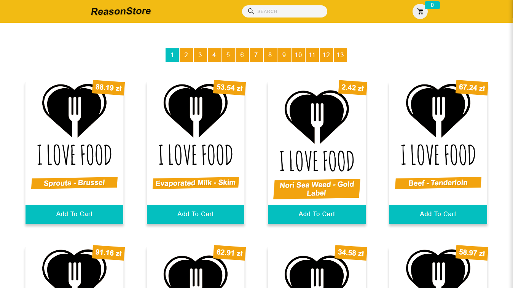

# :tada: ReasonStore

React application simulating a shopping cart.

## :rocket: Functionalities
**Main functionalities:**

* Downloading products from an [external API](https://www.reasonapps.pl/data.json)
* Displaying the list of products
* Pagination the list of products
* Ability to search for products by name
* Ability to add a product to the basket (automatically updating second list)
* Ability to remove a product from the basket
* Summary of added products

**Unfinished functionalities:**
* Show no results view
* Checkout validation

## :wrench: Tools

**The following tools were used in project:**
* **React** - Main technology
* **Axios** - Promise based HTTP client
* **Styled-components** - Writing styles
* **React Transition Group** - Exposes simple components useful for defining entering and exiting transitions
* **Storybook** - Build UI components
* **Context API** - share data across all levels of the application
* **Hooks** - use state and other React features without writing a class component
* **PropTypes** - checking for React props and similar objects

## :construction_worker: Install

### `npm install`

Installs the necessary application dependencies

## Available Scripts

In the project directory, you can run:

### `npm start`

Runs the app in the development mode. 
Open [http://localhost:3000](http://localhost:3000) to view it in the browser.

### `npm run storybook`
Runs the app in storybook. 
Open [http://localhost:9009](http://localhost:9009) to view it in the browser.
